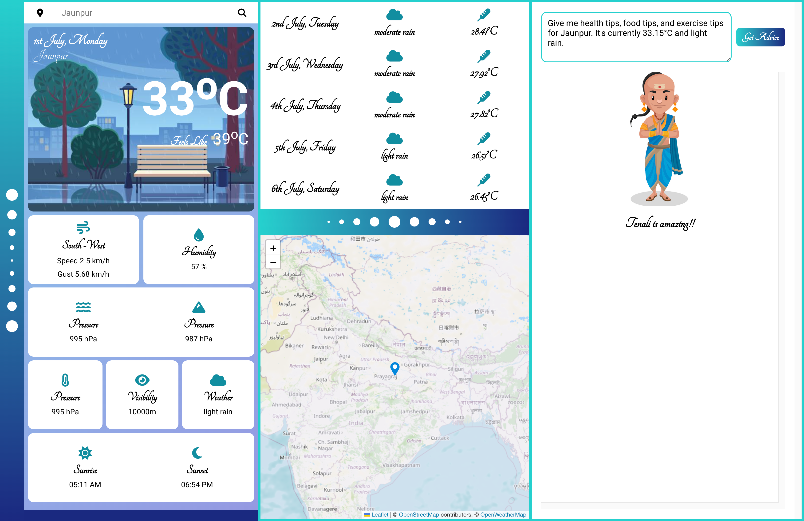
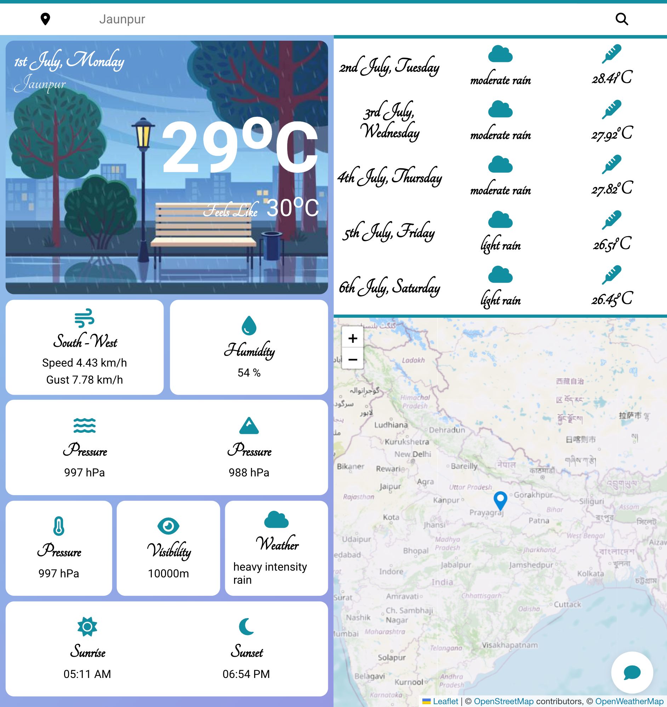
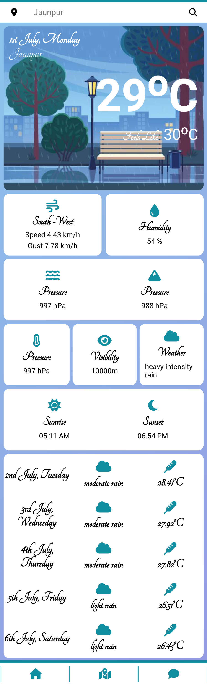

# Weather App

A brief description of what this project does and who it's for

## Overview

The Weather App is a user-friendly application designed to provide accurate and up-to-date weather information. With an intuitive interface and a variety of features, users can easily stay informed about current weather conditions, forecasts, and more.

## Features

- Current Weather: Get real-time weather updates for your location.
- Forecast: View weather forecasts for the next 5 days.
- Search Locations: Check weather conditions for different cities worldwide.
- User-friendly Interface: Simple and clean design for easy navigation.
- Weather Map: You can see weather map of your locationn.
- AI: Integrated with AI, which will give you some tips, for good food, good health, and exercise. You can ask any thing to it.

## Demo


_Screenshot of the app in large devices._


_Screenshot of the app in medium devices._


Screenshot of the app in small devices.

## Installation

To install the Weather App, follow these steps:

#### 1. Clone the repository

```bash
git clone https://github.com/SIDDHARTH-101251/weather-app.git
```

## Frontend

#### a. Navigate to the project's Frontend

```bash
cd weatherFrontend
```

#### b. Install dependencies

```bash
npm install
```

#### c. Start the application

```bash
npm Start
```

## Backend

#### a. Navigate to the project's Backend

```bash
cd weatherBackend
```

#### b. Install dependencies

```bash
npm install
```

#### c. Start the server

```bash
node index.js
```

## Usage

- Launch the App: Open the app on your device.
- View Current Weather: The homepage displays the current weather for your location.
- Search for a City: Use the search bar to find weather information for any city.
- Check Forecast: Navigate to the forecast section to see upcoming weather conditions.
- Chat with AI

## Technologies Used

- Frontend: React, leaflet.js
- Backend: Node.js, Express
- API: OpenWeatherMap API, OpenAI
- Styling: CSS, Bootstrap

## Contributing

- We welcome contributions! If you’d like to contribute, please follow these steps:
  - Fork the repository.
  - Create a new branch (git checkout -b feature/your-feature).
  - Commit your changes (git commit -am 'Add some feature').
  - Push to the branch (git push origin feature/your-feature).
  - Create a new Pull Request.

## LICENSE

This project is licensed under the MIT License - see the [LICENSE](LICENSE) file for details.

## Contact

If you have any questions or suggestions, feel free to contact us at 21052029@kiit.ac.in
